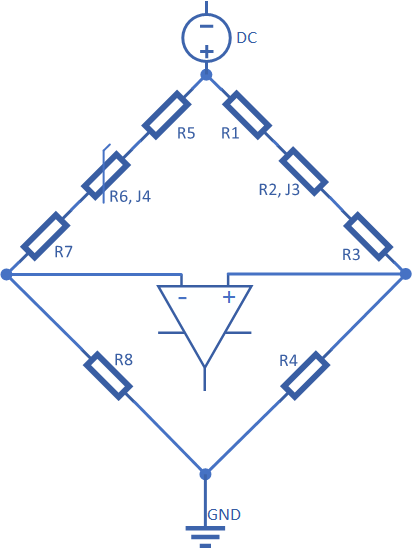

# All-purpose Power Micro Controller

This general purpose power micro controller features:
* Wheatstone Bridge front-end
* New Texas Instruments [INA823](https://www.ti.com/product/INA823) instrumentation amplifier (see schematic for alternatives)
* Accurate Texas Instruments [REF2030](https://www.ti.com/product/REF2030) 1.5/3V dual reference voltage source (<0.05%, 1.5 ppm/°C typ.)
* 48-pin [STM32G0B1CE](https://www.st.com/en/microcontrollers-microprocessors/stm32g0b1ce.html) 512kB flash, 144 kB RAM MPU (64kB flash minimum - see schematic for alternatives)
* Popular [Waveshare 18179](https://www.waveshare.com/1.3inch-oled-module-c.htm) 128x64 1.3" OLED display
* [STLINK-V3](https://www.st.com/en/development-tools/stlink-v3mini.html) mini and STLINK-V2 debug connectors, Segger J-Link mini supported.
* Rotary encoder and EEPROM  
* Small dimensions - only 85x50mm

Optional components:
* USB socket, can be used as a power source
* Real Time Clock (RTC) with quartz crystal oscillator
* Miniature battery or supercapacitor for RTC and memory backup
* Opto-isolated serial port (RX/TX)
* I2C port
* Two buffered DACs
* Larger [Waveshare 14747](https://www.waveshare.com/1.5inch-rgb-oled-module.htm) 128x128 1.5" RGB OLED display
* Two potentiometers for fine-tuning (gain and zero)

The device has been designed to be easily configured - e.g. here as a **Weller WSP80** station/controller powered from a standard 30V/5A bench power supply. I have built this universal controller to test some design concepts and have used it intensively for over a year as a **Weller WSP80** soldering iron controller.  
Published schematic includes probably the final 3rd version, slightly improved over what is presented on the pictures (2nd version). Controller can be easily configured to work with any NPT/PPT thermistor or a thermo-couple.

Language: C/C++

Environment: Cube IDE, Cube MX or VS Code - see [VS Code Environment Setup](Software/EnvironmentSetup.md)

License:
* [Software](Software) is released under MIT license.
* [Hardware](Hardware) KiCad design is released under Attribution-NonCommercial-NoDerivatives 4.0 International (CC BY-NC-ND 4.0) License.

Reviews:
* [ANOTHER NEAT GENERAL PURPOSE SOLDERING IRON DRIVER](https://hackaday.com/2022/01/31/another-neat-general-purpose-soldering-iron-driver) by Dave Rowntree

Improvement ideas (help wanted):
* Detecting idle state by analyzing temperature fluctuations and implementing auto sleep mode.
* Implementing self-calibration (PWM duty cycle) algorithm to increase temp precision by analyzing rate of temperature growth.
* Eliminate PWM - it adds significant ripple to the measured signal.

This repo contains complete documentation. If you are interested in building this device and need more details, please let me know rising an issue on GitHub.  
Improvements, suggestions and PRs are more than welcome - rise GitHub issue.  
Finally, if you like this project do not hesitate to give it a star to let others know it is worth checking out.

  
  
  
  
  
  