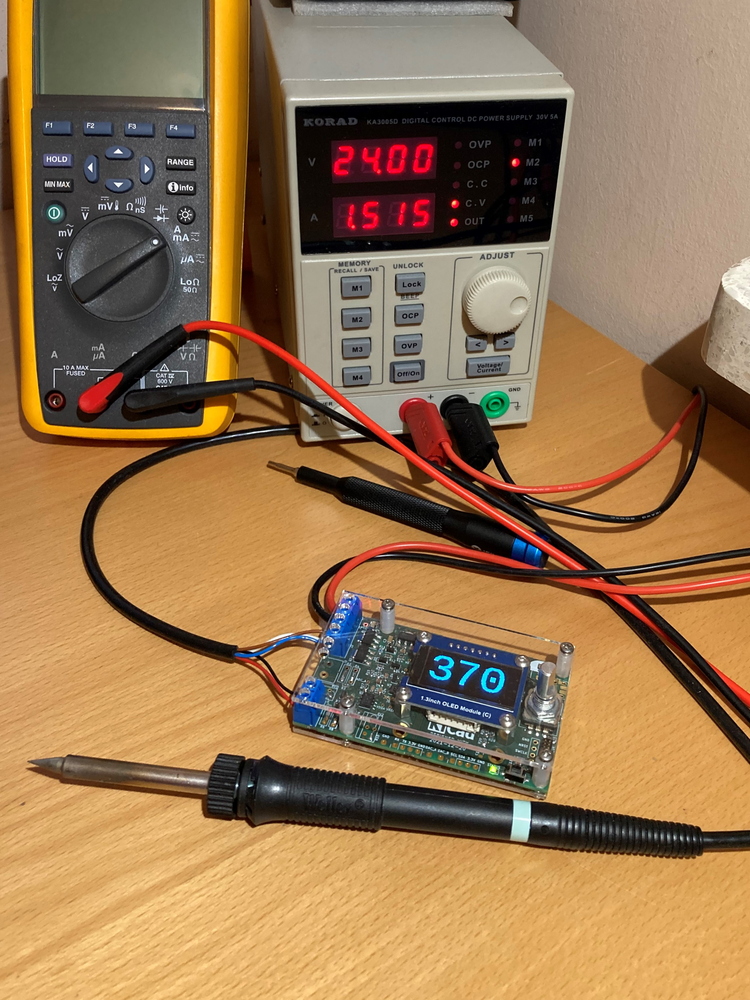
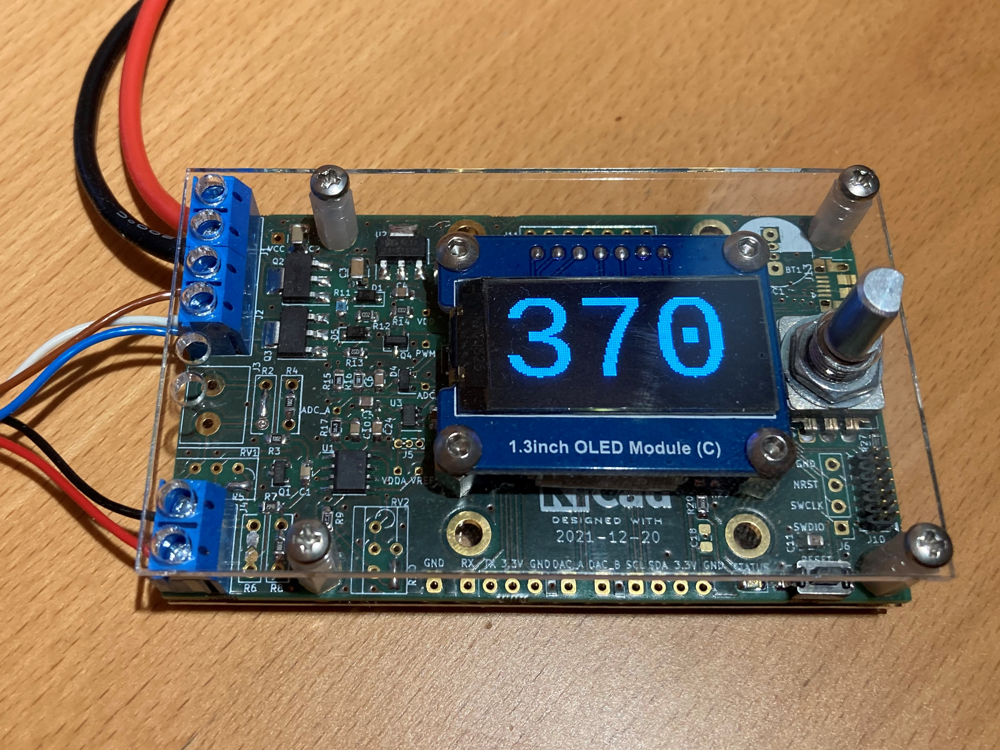
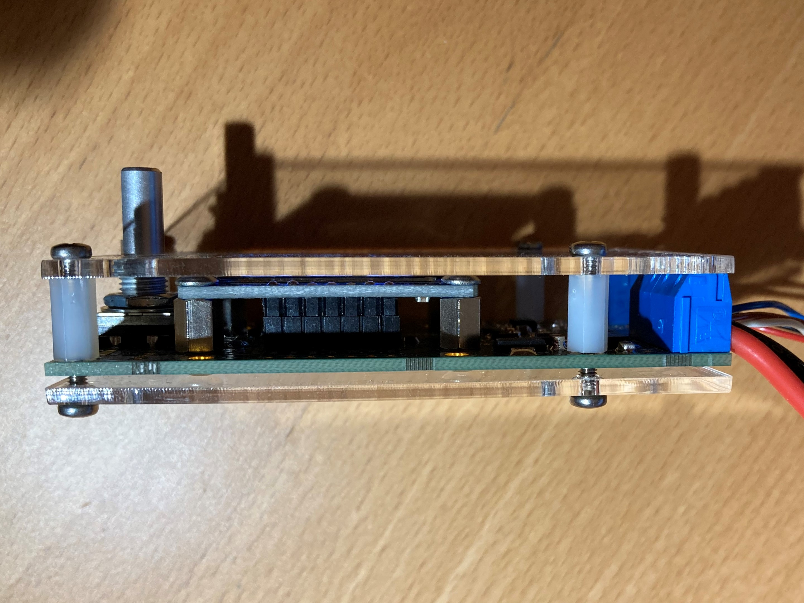
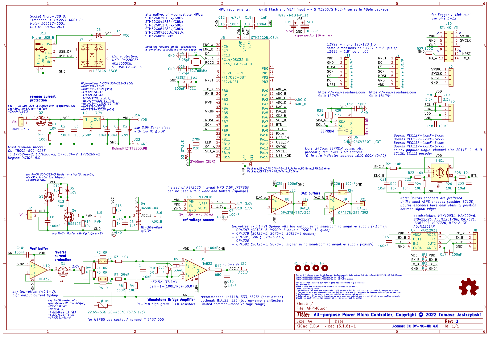

# All-purpose Power Micro Controller

This universal all-purpose power micro controller features:
* Wheatstone Bridge front-end
* new Texas Instruments [INA823](https://www.ti.com/product/INA823) instrumentation amplifier
* accurate (0.05%) Texas Instruments [REF2030](https://www.ti.com/product/REF2030) 1.5/3V reference voltage source
* 48-pin [STM32G0B1CE](https://www.st.com/en/microcontrollers-microprocessors/stm32g0b1ce.html) 512kB Flash, 144 kB RAM MPU
* [Waveshare 18179](https://www.waveshare.com/1.3inch-oled-module-c.htm) 128x64 1.3" OLED display
* [STLINK-V3](https://www.st.com/en/development-tools/stlink-v3mini.html) mini and STLINK-V2 connectors (Segger J-Link mini supported).
* encoder and EEPROM  

Device has been designed to be easily configured - e.g. as **Weller WSP80** station/controller.  
Optional support: USB, RTC clock, battery or supercapacitor backup, opto-isolated RX/TX, I2C, two buffered DACs, larger [Waveshare 14747](https://www.waveshare.com/1.5inch-rgb-oled-module.htm) 1.5" 128x128 RGB OLED display, potentiometers for fine-tuning.

I have built this all-purpose controller to test some design concepts and have used it intensively for over a year as **Weller WSP80** soldering iron controller, powered from a standard 30V/5A bench laboratory power supply.   
Published schematic includes probably a final version, slightly improved over what is presented on the pictures. Controller can be easily configured to work with any NPT/PPT thermistors or thermo-couples.

License:
* Software is released under MIT license
* Hardware design is released under Attribution-NonCommercial-NoDerivatives 4.0 International (CC BY-NC-ND 4.0) License

> This repo contains complete documentation. If you are interested in building this device and need more details, please let me know rising an issue on GitHub.  

  
  
  
  
  