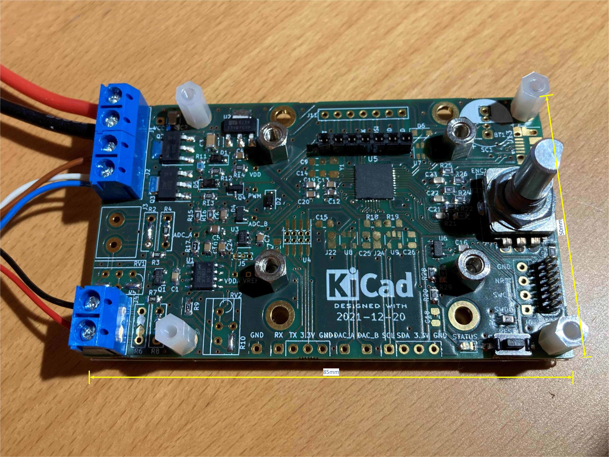
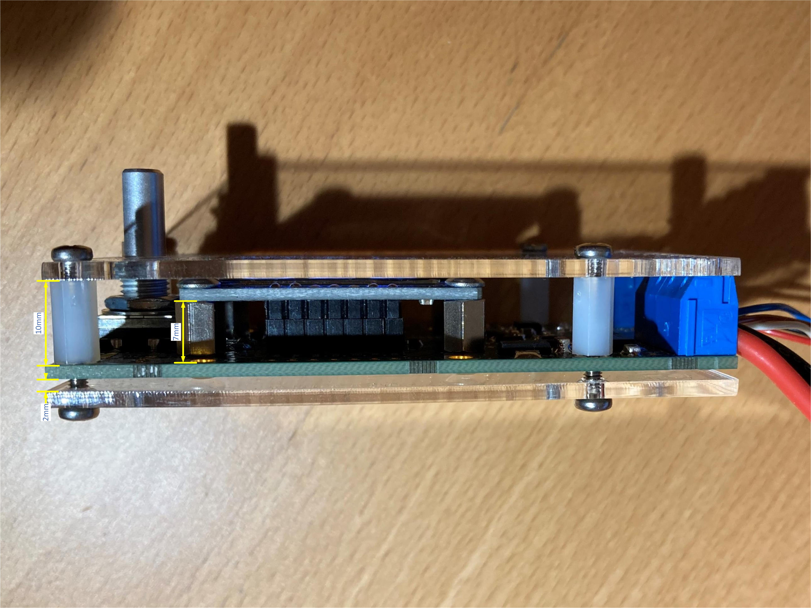
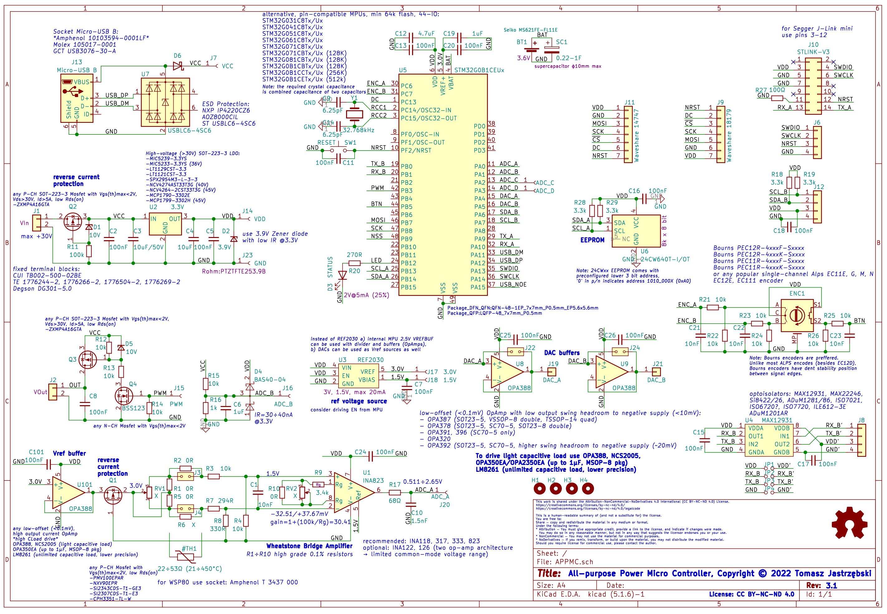

# All-purpose Power Micro Controller

This universal all-purpose power micro controller features:
* Wheatstone Bridge front-end
* New Texas Instruments [INA823](https://www.ti.com/product/INA823) instrumentation amplifier
* Accurate Texas Instruments [REF2030](https://www.ti.com/product/REF2030) 1.5/3V dual reference voltage source (<0.05%, 1.5 ppm/°C typ.)
* 48-pin [STM32G0B1CE](https://www.st.com/en/microcontrollers-microprocessors/stm32g0b1ce.html) 512kB Flash, 144 kB RAM MPU
* [Waveshare 18179](https://www.waveshare.com/1.3inch-oled-module-c.htm) 128x64 1.3" OLED display
* [STLINK-V3](https://www.st.com/en/development-tools/stlink-v3mini.html) mini and STLINK-V2 connectors (Segger J-Link mini supported).
* Rotary encoder and EEPROM  
* Small dimensions - only 85x50mm

Optional support:
* USB socket, can be used as a power source
* Real Time Clock (RTC) with quartz crystal oscillator
* Miniature battery or supercapacitor for RTC and memory backup
* Opto-isolated serial port (RX/TX)
* I2C port
* Two buffered DACs
* Larger [Waveshare 14747](https://www.waveshare.com/1.5inch-rgb-oled-module.htm) 1.5" 128x128 RGB OLED display
* Two potentiometers for fine-tuning (gain and zero)

The device has been designed to be easily configured - e.g. here as a **Weller WSP80** station/controller powered from a standard 30V/5A bench power supply. I have built this universal controller to test some design concepts and have used it intensively for over a year as a **Weller WSP80** soldering iron controller.  
Published schematic includes probably a third final version, slightly improved over what is presented on the pictures (2nd version). Controller can be easily configured to work with any NPT/PPT thermistors or thermo-couple.

License:
* [Software](Software) is released under MIT license
* [Hardware](Hardware) design is released under Attribution-NonCommercial-NoDerivatives 4.0 International (CC BY-NC-ND 4.0) License

> This repo contains complete documentation. If you are interested in building this device and need more details, please let me know rising an issue on GitHub.  

  
  
  
  
  